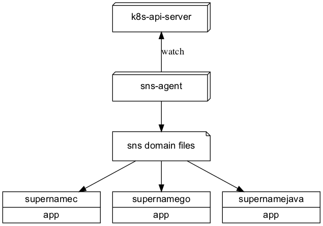

# supernamego 详细设计

[toc]

## 1. 概述

sns 总体设计如下图所示：

图1 sns 总体设计

supernamego 作为 [sns]() 的 Go 语言 SDK，其主要职责如下：

* 提供类 DNS 的服务发现功能
* 提供动态配置功能

## 2. 方案设计

SDK 需要实现如下功能：

* 通过网络与 sns-agent 模块交互，发送要订阅的域名和配置空间
* 通过文件读取订阅的域名地址及动态配置，并感知其实时变更
* 实现路由策略模块，支持路由的动态选择

## 3. 模块设计

