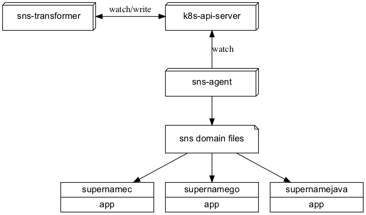
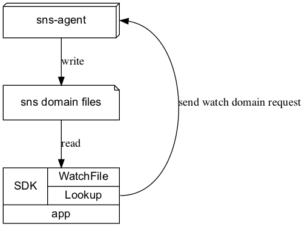
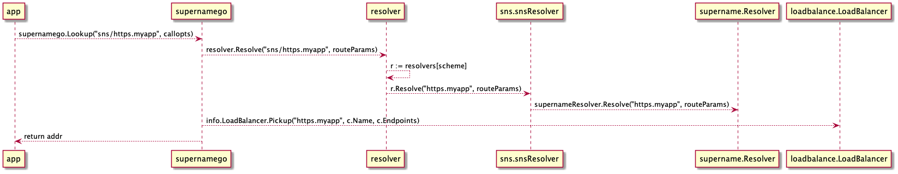
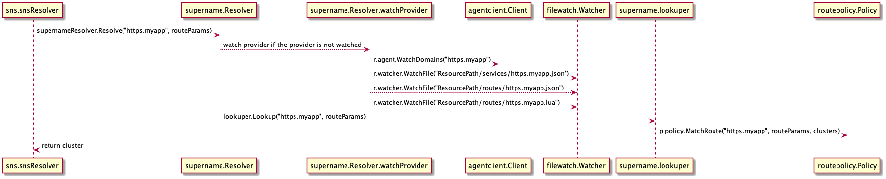
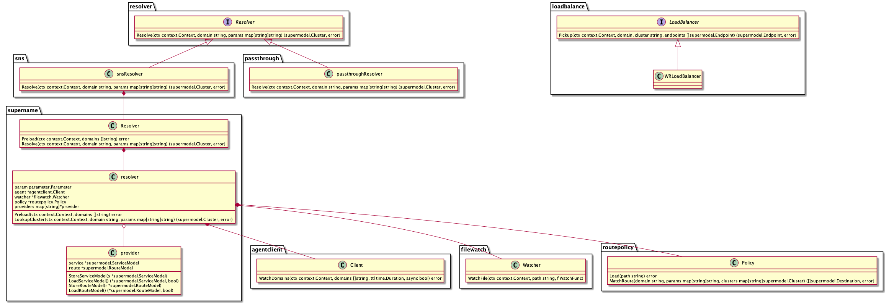

# supernamego 详细设计

[toc]

## 1. 概述

[SNS 总体设计](https://github.com/ironzhang/sns/blob/master/docs/design_cn.md) 如下图所示：



图1 SNS 总体设计

supernamego 作为 [SNS](https://github.com/ironzhang/sns) 的 Go 语言 SDK，其主要职责如下：

* 提供类 DNS 的服务发现功能
* 提供动态配置功能（TODO）

### 1.1. SDK 的用法

SDK 基本用法如下：

```go
package main

import (
        "context"
        "fmt"

        "github.com/ironzhang/supernamego"
)

func main() {
        err := supernamego.AutoSetup()
        if err != nil {
                fmt.Printf("supernamego auto setup: %v\n", err)
                return
        }

        addr, cluster, err := supernamego.Lookup(context.Background(), "sns/https.myapp")
        if err != nil {
                fmt.Printf("supernamego lookup: %v\n", err)
                return
        }
        fmt.Printf("cluster=%s, address=%v\n", cluster, addr)
}
```

如上所示，通过`supernamego.AutoSetup`进行初始化设置，再通过`supernamego.Lookup`将域名解析为 IP:Port。

除上述基本用法外，SDK 也支持通过`CallOption`设置额外参数，如：

```go
	// 设置路由参数
	params := map[string]string{
		"url_path": "/v1/api/get/order",
	}
	addr, cluster, err := supernamego.Lookup(context.Background(), "sns/https.myapp", supernamego.SetRouteParams(params))
	if err != nil {
		fmt.Printf("supernamego lookup: %v\n", err)
		return
	}
	fmt.Printf("cluster=%s, address=%v\n", cluster, addr)


	// 设置负载均衡算法
	lb := &loadbalance.WRLoadBalancer{}
	addr, cluster, err = supernamego.Lookup(context.Background(), "sns/https.myapp", supernamego.SetLoadBalancer(lb))
	if err != nil {
		fmt.Printf("supernamego lookup: %v\n", err)
		return
	}
	fmt.Printf("cluster=%s, address=%v\n", cluster, addr)
```

为了方便联调测试，我们也支持如下用法：

```
	// 直接解析 IP:Port
	addr, cluster, err := supernamego.Lookup(context.Background(), "192.168.1.1:80")
	if err != nil {
		fmt.Printf("supernamego lookup: %v\n", err)
		return
	}
	fmt.Printf("cluster=%s, address=%v\n", cluster, addr) // 返回的 addr = "192.168.1.1:80"
```

这种情况下，用户如果将 SNS 域名配置化，在联调测试时，直接将配置中域名改成 IP:Port，即可方便地进行联调和测试，参见[sns-echo 示例](../examples/sns-echo/client/main.go)。

### 1.2. SDK 的参数配置

为了提供更高的灵活性，以及今后适配更多的操作系统，我们提供了一个`supername.conf`配置文件：

```toml
[Agent]
        Server = "127.0.0.1:1789"
        SkipError = true
        Timeout = 2
        KeepAliveTTL = 600
        KeepAliveInterval = 10

[Watch]
        ResourcePath = "/Users/iron/.supername/resource"
        WatchInterval = 1
```

系统运维人员可以通过该配置文件调整 SDK 的某些行为逻辑和运行参数。

> 该文件的路径由实际的操作系统而定，且不是必须的，如不存在，SDK 会构造一套默认参数。

## 2. 方案设计

要实现类 DNS 的服务发现和动态配置这两大核心功能，SDK 需要做如下工作：

* 通过网络与 sns-agent 模块交互，发送要订阅的域名和配置空间。
* 通过文件读取订阅的域名地址及动态配置，并感知其变更。
* 实现路由策略模块，支持七层语义的流量调度。

其工作原理如下图所示：



图2 SNS SDK 工作原理图

## 3. 模块设计

supernamego 的主要模块如下所示：

```
├── core
│   ├── loadbalance
│   └── supername
│       └── routepolicy
└── resolver
    ├── passthrough
    └── sns
```

`core/supername`模块负责将一个 SNS 域名解析为一个对应的集群，其子模块`core/supername/routepolicy`则负责路由计算，即通过调用方传递进入的路由参数和下发的路由脚本，计算出应当访问域名下的哪个集群。

`core/loadbalance`则负责负载均衡算法，即在确定集群后，从集群的地址列表中挑选出一个地址来访问。

`resolver`模块则是各类解析器的集合，其下的`resolver/passthrough`子模块负责解析`192.168.1.1:80`这类 IP:Port 格式的地址，而`resolver/sns`子模块则负责解析`sns/https.myapp`这类 SNS 域名。

### 3.1. 核心流程

SNS 域名解析的主流程如下图所示：



图3 SNS 域名解析主流程

`supername.Resolver`是其中的核心模块，其内部的代码运行流程如下：



图4 supername.Resolver 的代码运行流程

### 3.2. 代码类图

下图展示了`supernamego`的代码类图：



图5 supernamego 的代码类图

